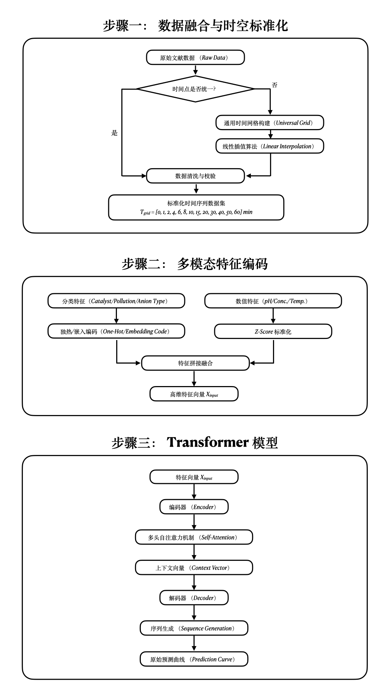
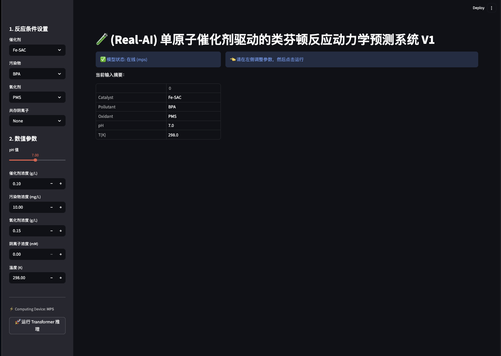
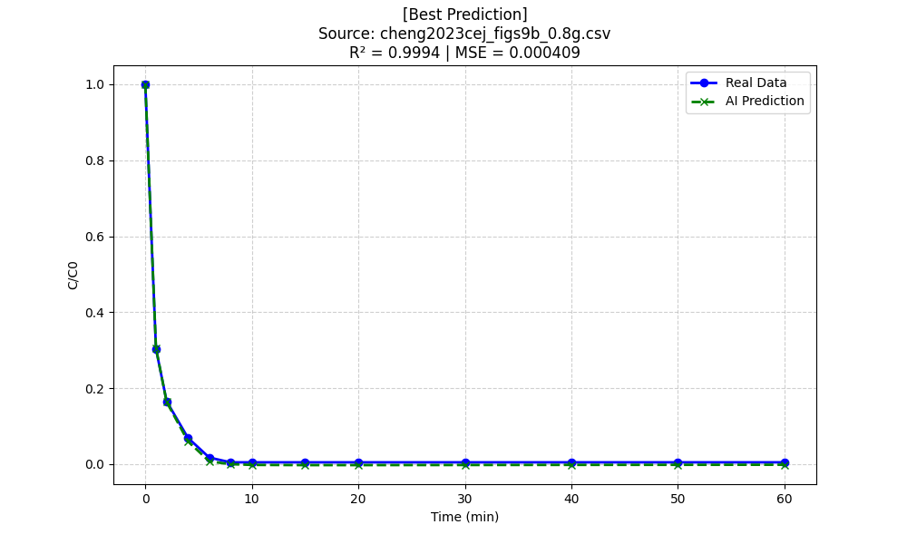
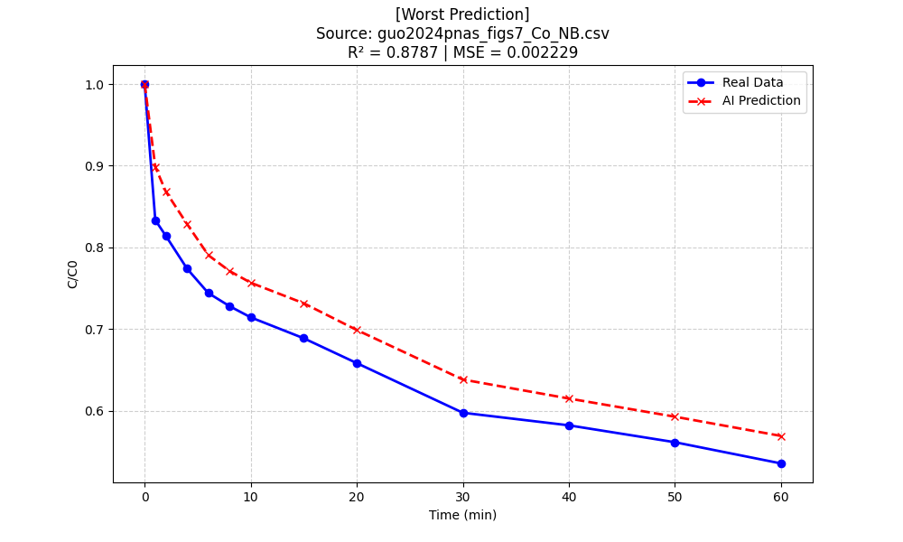

<div align="center">

# 🧪 AI-Driven Kinetics Prediction System for Single-Atom Catalysts (SACs)

[](https://www.python.org/)
[](https://pytorch.org/)
[](https://streamlit.io/)
[](LICENSE)

<!-- 语言切换按钮 -->
[](README_EN.md)
[](README.md)

> **A Deep Learning framework integrating Transformer architecture with physics-informed constraints to predict the full-process degradation kinetics of organic pollutants by Single-Atom Catalysts (SACs).**

</div>

---

## 🌟 Key Features

*   **📈 End-to-End Sequence Prediction**: Unlike traditional ML models that predict a single $k$ value, this model generates full 0-60 min kinetic curves using an **Encoder-Decoder Transformer**.
*   **🧬 Multi-Modal Feature Embedding**: Encodes catalyst structures (metal center, coordination), environmental factors (pH, anions), and pollutant properties.
*   **⚛️ Physics-Informed Constraints**: Incorporates mass conservation and monotonicity checks to ensure physically valid predictions (no negative concentrations).
*   **🚀 Real-Time Visualization**: Interactive Web App built with **Streamlit**, supporting hardware acceleration (CUDA/MPS).

## 🛠️ System Architecture

### 1. Data Pipeline
Automated ETL process for multi-source heterogeneous data alignment.

<div align="center">
  
</div>

### 2. Model Architecture
A customized Transformer with Self-Attention mechanisms.

<div align="center">
  
</div>

---

## 🚀 Quick Start

### 1. Installation
```bash
git clone https://github.com/AdorableLake/SACs-Kinetics-Transformer.git
cd SACs-Kinetics-Transformer
pip install -r requirements.txt
```

### 2. Run the Web GUI
```bash
streamlit run app_real.py
```

---

## 📊 Performance
- R² Score: > 0.99 (on Test Set)
- RMSE: < 0.03
- Hardware Support: Auto-detects NVIDIA CUDA or Apple MPS (Metal Performance Shaders) for acceleration.

---

## 📷 Screenshots
- Interactive Dashboard
<div align="center">

</div>

- Prediction Results (Best vs Worst Case)
<div align="center">


</div>

---

## 👨‍💻 Author
Lake (AdorableLake)
- 🎓 M.S. Environmental Engineering |  Georgia Tech & Tianjin Univ.
- 🎓 B.S. Industrial Design | Zhejiang Sci-Tech Univ.
- 🔬 Research Focus: AI for Science, Environmental Informatics, Human Computer Interactiion.

---

*Disclaimer: This project is part of a research study. Data availability subject to publication status.*
